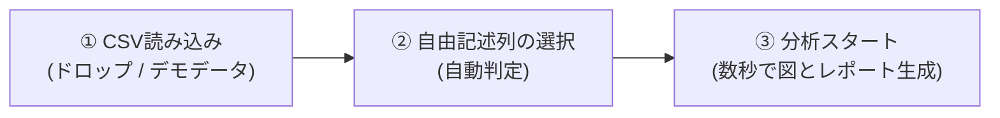

# アンケート自由記述 潜在因子 探索ツール (Survey Factor Analyzer)

アンケートの自由記述テキストから、統計の難しい知識や複雑な設定を必要とせず、**顧客・回答者の背後にある「潜在的な意見テーマ（因子）」をワンクリックで自動発見・可視化**するWebアプリケーションです。

外部サーバーへデータを一切送信せず、お使いのWebブラウザ内（ローカル環境）で高速かつ安全に処理が完結します。

---

## 📌 目次
1. [本ツールの特長](#1-本ツールの特長)
2. [搭載されている4つの図（ビジュアル表現）](#2-搭載されている4つの図ビジュアル表現)
3. [クイックスタート（使い方の流れ）](#3-クイックスタート使い方の流れ)
4. [起動方法・動作環境](#4-起動方法動作環境)
5. [アルゴリズムと内部処理](#5-アルゴリズムと内部処理)
6. [ディレクトリ構成・使用ライブラリ](#6-ディレクトリ構成使用ライブラリ)

---

## 1. 本ツールの特長

* 🎯 **専門用語ゼロ・完全ノーコード**:
  「固有値」「バリマックス回転」「因子負荷量」といった難解な統計用語は画面に出さず、「意見テーマ」「重要キーワード」「代表的な回答」として直感的に表示します。
* 🔒 **安心の完全オフライン動作**:
  社外秘アンケートや個人情報を含む自由記述も、ブラウザ外へ送信されることは一切ありません。
* 📊 **豊富な図（チャート）による直感的な表現**:
  全体シェア、意味空間ポジショニングマップ、単語影響度バー、属性クロス集計など、多彩な図で多角的にインサイトを提示します。
* 👁️ **即時データプレビュー ＆ インライン直接修正**:
  ファイルを読み込むと、最初の数行を即座にプレビュー表示。「全行表示」への切り替えや、表内のセルをクリックして直接テキストを修正・追記、不要行の削除（🗑️）が可能です。
* ⚠️ **空欄・無効データの自動検知・注意アラート**:
  自由記述の未記入（空欄）や「特になし」等の定型回答、数値コード（999等）を自動検出し、注意アラートとバッジで明示。「問題のある行のみ」ワンクリックで絞り込んで素早く確認・修正できます。
* 🖨️ **A4用紙のスマートレポート出力（印刷 / PDF保存）**:
  ワンクリックでA4縦の完結レポート（属性指定なし: 2枚、属性指定あり: 3枚）にぴったり収まる印刷・PDF保存機能を搭載。社内配布や会議資料が即座に完成します。
* 📝 **カスタム辞書機能（除外ワード・複合語・表記ゆれ統一 ＆ ワンクリック除外）**:
  - **除外ワード（ストップワード）**: 360語以上の標準ストップワードに加え、業界・アンケート固有のノイズ語（「店」「利用」等）を任意に除外。因子カードのキーワード横にある「✕」ボタンを押すだけで**ワンクリック除外＆自動再分析**が可能です。
  - **複合語（強制抽出）**: 「アフターサポート」「生成AI」「UI改善」など、細切れに分解されたくない重要フレーズをひとまとまりの語として抽出し、因子の精度を高めます。
  - **表記ゆれの統一**: 「スマホ → スマートフォン」「クレーム → 苦情」など同義語を束ねて意見の分散を防止。
  - **他ツールとの共通ルール互換**: 姉妹ツール（`text-analysis-test`）と完全互換の設定ファイル（`.txt`）のインポート・エクスポートや、ブラウザへの自動保存に対応。

---

## 2. 搭載されている主要な図と表（ダッシュボード構成）

```
┌────────────────────────────────────────────────────────────────────────┐
│ 【上段：全体像とデータ特性（まず前提となるデータ量と語彙を把握）】     │
│ ┌─ 【表1】テキスト全体の基本統計 ────┐ ┌─ 【図1】潜在因子構成比 ────────────┐ │
│ │  ・平均/最長文字数, 有効回答率      │ │  (ドーナツチャート)                │ │
│ │  ・検出語彙数, 最頻出単語TOP5       │ │  各因子の全体シェア                │ │
│ └──────────────────────────────────────┘ └────────────────────────────────────┘ │
├────────────────────────────────────────────────────────────────────────┤
│ 【中段：因子の詳細構造と空間マップ（2つ並び）】                        │
│ ┌─ 【図2】パス図 ────────────────────┐ ┌─ 【図3】因子空間ポジショニングマップ ─┐ │
│ │  (潜在因子 ──[関連度]──> 重要単語) │ │  横軸: [因子1] ✕ 縦軸: [因子2]       │ │
│ │  因果構造と語への影響度            │ │  [● 回答者得点 / ○ 語の関連度] 切替  │ │
│ └────────────────────────────────────┘ └──────────────────────────────────────┘ │
├────────────────────────────────────────────────────────────────────────┤
│ 【下段：属性別分析（任意・属性列指定時）】                             │
│  ・【図4】属性別クロス集計（各属性における因子の割合帯グラフ）         │
│  ・【図5】属性別因子空間マップ比較（Small Multiples / ゴーストプロット） │
├────────────────────────────────────────────────────────────────────────┤
│ 【最下段：各因子の詳細カード（重要キーワード ＋ 生の声抜粋・属性表示）】│
└────────────────────────────────────────────────────────────────────────┘
```

1. **【基本統計表】テキスト全体の基本統計 ＆ 特性プロファイル（表1）**:
   - 分析の前提情報として、回答の熱量を示す「1件あたり平均文字数・最長文字数」、テキスト全体の「語彙数・総文字数」、および「最頻出キーワード TOP 5」を整理して提示します。
2. **【全体シェア図】潜在因子構成比ドーナツチャート（図1）**:
   - データ全体の中で、各潜在因子が回答全体の何％を占めているかをひと目で把握できます。スライスをクリックすると、該当因子の詳細カードへスクロールします。
3. **【構造図】パス図（Path Diagram）（図2）**:
   - 各潜在因子（楕円）から重要単語（四角）へ伸びる矢印の太さと数値が **関連度（関連の強さ、最大1.00）** を表現します。
4. **【鳥瞰図】因子空間ポジショニングマップ（図3）**:
   - パス図の隣に配置され、見やすい正方形に近いアスペクト比で描画されます。
   - 横軸・縦軸を任意の因子（因子1〜K）に切り替え可能。
   - **［回答者の因子得点］**: 回答者ごとの傾向分布。点にマウスを乗せると回答文や属性情報が読めます。
   - **［語の関連度］**: 単語ごとの布置図。各語がどの因子軸と強く関連しているか（語同士の関係性）が分かります。
   - **［属性による絞り込み］**: 属性列がある場合、「全属性（全体）」または特定の属性（例: 20代）を選択可能。特定属性を選択すると、全体が薄い影（ゴースト）となり、該当属性の回答だけが因子色でハイライト表示されます。
5. **【比較図】属性別クロス集計チャート（図4）**:
   - CSV内に「年代」や「満足度」などの列がある場合、属性ごとの因子内訳を100%積み上げ横棒グラフで比較できます。
6. **【レポート出力】属性別因子空間マップ比較（全属性並列スモールマルチプルズ）**:
   - Web画面上では重複を避けてシンプルに保つため非表示ですが、**レポート印刷・PDF保存時に自動出力**されます。
   - 図3で組み合わせたX軸・Y軸に基づき、全属性（20代、30代、40代…）の意見分布を背景ゴースト付きで一覧比較できます。
7. **【詳細表】発見された潜在因子の詳細 ＆ 生の声（表2）**:
   - 各因子を特徴づけている重要キーワードの関連度バー（横棒グラフ）と、代表回答（属性バッジ付き）をカード形式で確認できます。全回答一覧モーダルやCSVエクスポートにも属性列が反映されます。

---

## 3. クイックスタート（使い方の流れ）



1. **ファイル投入**:
   - お手元のアンケートCSV/TSV/TXTファイルをドラッグ＆ドロップします。
   - すぐに機能を試したい場合は、画面右上の **「💡 デモデータで試す」** を押してください。
2. **プレビュー確認 ＆ 列・パラメータ設定**:
   - 投入後、直ちにデータ内容のプレビューと入力品質チェック（空欄や定型無効回答の有無）が表示されます。
   - 必要に応じて表内のセルを直接クリックして修正・追記したり、不要な行を 🗑️ で削除できます。
   - 「全行表示」や「⚠️ 問題のある行のみ」のワンクリック絞り込みも可能です。
   - 自由記述列・属性列・抽出テーマ数を確認・微調整します。
3. **分析実行**:
   - **「🚀 分析スタート」** をクリックすると、形態素解析・因子分解・図の描画が数秒で完了します。
   - テーマの名称をクリックすると、自由にわかりやすい名前に書き直すことができます。

---

## 4. 起動方法・動作環境

* **動作環境**: Google Chrome, Microsoft Edge, Safari 等のモダンWebブラウザ

### Windows の場合
同梱の **`kidou.bat`** をダブルクリックして起動します。
（ブラウザのローカルファイルセキュリティ制限を自動バイパスして開きます）

### Linux / Mac の場合
ターミナルで以下のスクリプトを実行します。
```bash
./start_server.sh
```
または Python の簡易サーバーを起動してアクセスしてください。
```bash
python3 -m http.server 8080
# ブラウザで http://localhost:8080 を開く
```

---

## 5. アルゴリズムと内部処理

* **形態素解析・辞書前処理**:
  - `kuromoji.js` による高精度な日本語単語分割。
  - **カスタム複合語結合 ＆ 表記ゆれ統一**: ユーザー登録した複合語（最長一致）を優先結合し、表記ゆれを置換した上で、連続名詞の自動結合を行います。
  - **ストップワード除外**: `text-analysis-test` と共通の SlothLib 由来 360語以上の標準ストップワードリスト ＋ ユーザー指定の除外語をフィルタリング。
* **潜在因子・テーマ抽出**: **NMF（非負値行列因子分解）** を採用。
  - すべての寄与度が「0%〜100%の正の値」で表されるため、従来の因子分析における「負の負荷量（マイナスの値）」のような解釈の難しさがありません。
* **因子空間ポジショニングマップ**: 因子分析の各因子軸（回答者の「因子得点」または単語の「関連度」）を直接プロット。横軸・縦軸に選択した2つの因子に対する回答者や語の明確な位置づけ・関係性を可視化します（PCAのような直交合成軸ではなく、因子そのものの軸を使用）。

---

## 6. ディレクトリ構成・使用ライブラリ

### ディレクトリ構成
```text
survey-factor-analyzer/
├── index.html              # メインアプリケーション画面
├── kidou.bat               # Windows用起動バッチ
├── start_server.sh         # Linux/Mac用起動スクリプト
├── css/
│   └── style.css           # ダッシュボード・カード・辞書設定デザイン
├── js/
│   ├── app.js              # 全体オーケストレーション・辞書設定・イベント
│   ├── csv_parser.js       # CSVパース・列自動推測
│   ├── stopwords_default.js# 標準ストップワード基本辞書定数（CORSフォールバック）
│   ├── text_preprocessor.js# 形態素解析・複合語結合・辞書パース・TF-IDF計算
│   ├── factor_engine.js    # NMF因子分解・PCA 2D投影
│   ├── charts.js           # Plotlyチャート描画
│   └── demo_data.js        # デモ用アンケートデータ
├── data/
│   ├── stopwords.txt       # 標準ストップワードリスト（SlothLib由来）
│   ├── custom_rules.txt    # 辞書・ルール設定見本ファイル（共通フォーマット）
│   └── sample_survey.csv   # サンプルアンケートCSV
├── lib/
│   ├── kuromoji/           # 日本語形態素解析器＆辞書データ
│   ├── plotly.min.js       # インタラクティブチャートライブラリ
│   └── papaparse.min.js    # CSVパーサー
└── README.md               # 本ドキュメント
```

### 使用ライブラリ
* [Kuromoji.js](https://github.com/takuyaa/kuromoji.js/) (Apache-2.0)
* [Plotly.js](https://plotly.com/javascript/) (MIT)
* [PapaParse](https://www.papaparse.com/) (MIT)
