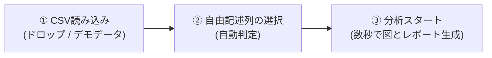

# アンケート自由記述 潜在因子分析ツール (Survey Factor Analyzer)

アンケートの自由記述テキストから、統計の難しい知識や複雑な設定を必要とせず、**顧客・回答者の背後にある「潜在的な意見テーマ（因子）」をワンクリックで自動発見・可視化**するWebアプリケーションです。

外部サーバーへデータを一切送信せず、お使いのWebブラウザ内（ローカル環境）で高速かつ安全に処理が完結します。

---

## 📌 目次
1. [本ツールの特長](#1-本ツールの特長)
2. [搭載されている4つの図（ビジュアル表現）](#2-搭載されている4つの図ビジュアル表現)
3. [クイックスタート（使い方の流れ）](#3-クイックスタート使い方の流れ)
4. [起動方法・動作環境](#4-起動方法動作環境)
5. [アルゴリズムと内部処理](#5-アルゴリズムと内部処理)
6. [ディレクトリ構成・使用ライブラリ](#6-ディレクトリ構成使用ライブラリ)

---

## 1. 本ツールの特長

* 🎯 **専門用語ゼロ・完全ノーコード**:
  「固有値」「バリマックス回転」「因子負荷量」といった難解な統計用語は画面に出さず、「意見テーマ」「重要キーワード」「代表的な回答」として直感的に表示します。
* 🔒 **安心の完全オフライン動作**:
  社外秘アンケートや個人情報を含む自由記述も、ブラウザ外へ送信されることは一切ありません。
* 📊 **豊富な図（チャート）による直感的な表現**:
  全体シェア、意味空間ポジショニングマップ、単語影響度バー、属性クロス集計など、多彩な図で多角的にインサイトを提示します。
* 💬 **「生の顧客の声」と直結**:
  各テーマをクリックするだけで、その意見を代表する実際の回答文が読めるため、報告や意思決定に直結します。
* 📷 **レポート画像ワンクリック保存**:
  分析結果ダッシュボードを、そのままプレゼン資料や社内報告に貼り付けられる高画質PNG画像としてエクスポートできます。

---

## 2. 搭載されている主要な図と表（ダッシュボード構成）

```
┌────────────────────────────────────────────────────────────────────────┐
│ 【上段：全体像とデータ特性】                                           │
│ ┌─ 【図1】潜在因子構成比 ────────────┐ ┌─ 【表】テキスト全体の基本統計 ─────┐ │
│ │  (ドーナツチャート)                │ │  ・平均/最長文字数, 有効回答率      │ │
│ │  各因子の全体シェア                │ │  ・検出語彙数, 最頻出単語TOP5       │ │
│ └────────────────────────────────────┘ └──────────────────────────────────────┘ │
├────────────────────────────────────────────────────────────────────────┤
│ 【中段：因子の詳細構造と空間マップ（2つ並び）】                        │
│ ┌─ 【図2】因子パス図 ────────────────┐ ┌─ 【図3】因子空間ポジショニングマップ ─┐ │
│ │  (潜在因子 ──[負荷量]──> 観測単語) │ │  横軸: [因子1] ✕ 縦軸: [因子2]       │ │
│ │  因果構造と語への影響度            │ │  [● 回答者得点 / ○ 語の負荷量] 切替  │ │
│ └────────────────────────────────────┘ └──────────────────────────────────────┘ │
├────────────────────────────────────────────────────────────────────────┤
│ 【下段：属性クロス集計（任意） ＆ 各因子の詳細カード（重要語 ＋ 生の声）】│
└────────────────────────────────────────────────────────────────────────┘
```

1. **【全体シェア図】潜在因子構成比ドーナツチャート**:
   - 各潜在因子が回答全体の何％を占めているかをひと目で把握できます。スライスをクリックすると、該当因子の詳細カードへスクロールします。
2. **【基本統計表】テキスト全体の基本統計 ＆ 特性プロファイル**:
   - 回答の熱量を示す「1件あたり平均文字数・最長文字数」、テキスト全体の「語彙数・総文字数」、および「最頻出キーワード TOP 5」を整理して提示します。
3. **【構造図】因子パス図（Factor Path Diagram）**:
   - 因子分析の象徴である構造図です。「潜在因子（楕円）」から「観測単語（四角）」へ伸びる矢印の太さと数値が **因子負荷量（関連の強さ）** を表現します。
4. **【鳥瞰図】因子空間ポジショニングマップ（散布図）**:
   - パス図の隣に配置され、見やすい正方形に近いアスペクト比で描画されます。
   - 横軸・縦軸を任意の因子（因子1〜K）に切り替え可能。
   - **［回答者の因子得点］**: 回答者ごとの傾向分布。点にマウスを乗せると回答文が読めます。
   - **［語の因子負荷量］**: 単語ごとの布置図。各語がどの因子軸に引っ張られているか（語同士の関係性）が分かります。
5. **【詳細図】因子別・重要単語負荷量バー（横棒グラフ） ＆ 生の声**:
   - その因子を特徴づけている上位キーワードの負荷量と、それを強く反映した代表回答をカード形式で確認できます。
6. **【比較図】属性別クロス集計チャート**:
   - CSV内に「年代」や「満足度」などの列がある場合、属性ごとの因子内訳を100%積み上げ棒グラフで比較できます。

---

## 3. クイックスタート（使い方の流れ）



1. **ファイル投入**:
   - お手元のアンケートCSV/TSVファイルをドラッグ＆ドロップします。
   - すぐに機能を試したい場合は、画面右上の **「💡 デモデータで試す」** を押してください。
2. **列の確認**:
   - ツールが自動的に「自由記述と思われる列」を推測して選択します。
   - 年代や満足度などの「属性列」があれば併せて指定します。
   - 見つけたいテーマの数（初期値は自動推奨）を「＋」「−」で微調整できます。
3. **分析実行**:
   - **「🚀 分析スタート」** をクリックすると、形態素解析・因子分解・図の描画が数秒で完了します。
   - テーマの名称をクリックすると、自由にわかりやすい名前に書き直すことができます。

---

## 4. 起動方法・動作環境

* **動作環境**: Google Chrome, Microsoft Edge, Safari 等のモダンWebブラウザ

### Windows の場合
同梱の **`kidou.bat`** をダブルクリックして起動します。
（ブラウザのローカルファイルセキュリティ制限を自動バイパスして開きます）

### Linux / Mac の場合
ターミナルで以下のスクリプトを実行します。
```bash
./start_server.sh
```
または Python の簡易サーバーを起動してアクセスしてください。
```bash
python3 -m http.server 8080
# ブラウザで http://localhost:8080 を開く
```

---

## 5. アルゴリズムと内部処理

* **形態素解析**: `kuromoji.js` による高精度な日本語単語分割、連続する名詞の自動複合化、およびアンケート定型ノイズ（「特になし」「思う」「ある」など）の自動除去。
* **潜在因子・テーマ抽出**: **NMF（非負値行列因子分解）** を採用。
  - すべての寄与度が「0%〜100%の正の値」で表されるため、従来の因子分析における「負の負荷量」のような解釈の難しさがありません。
* **ポジショニングマップ**: 回答ベクトルを **PCA（主成分分析）** により2次元に圧縮・直交射影。

---

## 6. ディレクトリ構成・使用ライブラリ

### ディレクトリ構成
```text
survey-factor-analyzer/
├── index.html              # メインアプリケーション画面
├── kidou.bat               # Windows用起動バッチ
├── start_server.sh         # Linux/Mac用起動スクリプト
├── css/
│   └── style.css           # ダッシュボード・カードデザイン
├── js/
│   ├── app.js              # 全体オーケストレーション・イベント
│   ├── csv_parser.js       # CSVパース・列自動推測
│   ├── text_preprocessor.js# kuromoji形態素解析・TF-IDF計算
│   ├── factor_engine.js    # NMF因子分解・PCA 2D投影
│   ├── charts.js           # Plotlyチャート描画
│   └── demo_data.js        # デモ用アンケートデータ
├── data/
│   └── sample_survey.csv   # サンプルアンケートCSV
├── lib/
│   ├── kuromoji/           # 日本語形態素解析器＆辞書データ
│   ├── plotly.min.js       # インタラクティブチャートライブラリ
│   ├── papaparse.min.js    # CSVパーサー
│   └── html2canvas/        # 高画質画像レポート出力
└── README.md               # 本ドキュメント
```

### 使用ライブラリ
* [Kuromoji.js](https://github.com/takuyaa/kuromoji.js/) (Apache-2.0)
* [Plotly.js](https://plotly.com/javascript/) (MIT)
* [PapaParse](https://www.papaparse.com/) (MIT)
* [html2canvas](https://html2canvas.hertzen.com/) (MIT)
